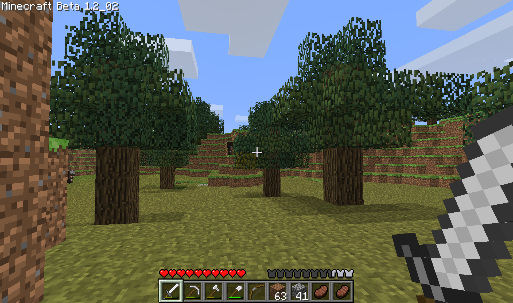
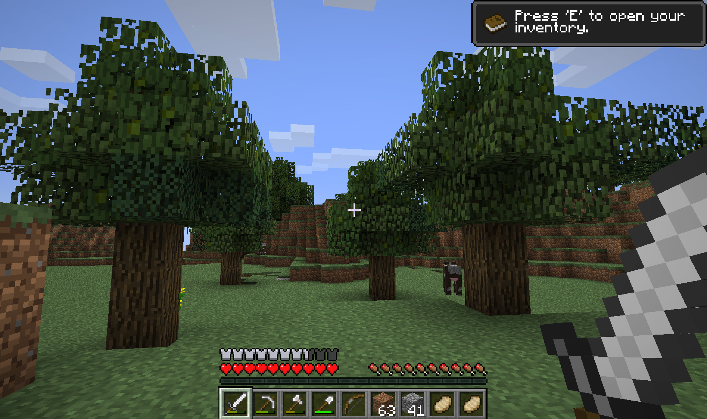
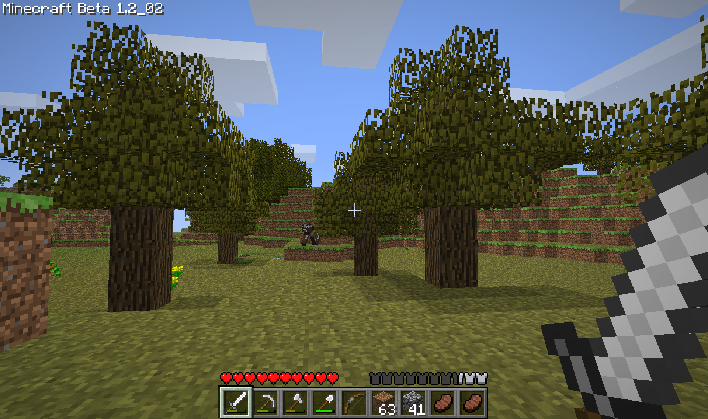

# Alpha Tree Fixer

A program to fix broken / mismatched leaves in Minecraft worlds generated before Alpha v1.2.0, for those who enjoy playing through older Minecraft updates.

If you don't know what this problem is referring to, you probably don't need this tool, but just in case:

## Problem Description

When a Minecraft world generated before Alpha v1.2.0 is updated to Minecraft Beta (specifically, the problem arrives in Beta 1.2), all trees generated / grown before the Alpha v1.2.0 point will end up with garbled leaves. A random subset of their leaves will be spruce or birch instead of oak.

This problem never goes away on its own; the trees can be cut down or the leaves replaced, but that's a lot of leaves if you're an explorer. And if the world is updated beyond that to versions with more leaf types, the problem worsens. Once updated to Minecraft Full Release 1.2, jungle leaves will start appearing.

### Examples

This was a world generated in Minecraft Alpha v1.0.15. This is what happened when updated to Beta 1.2:

Then, after being updated to Full Release 1.2 (stopping in Beta 1.3 along the way for a world type conversion):

Generally, the solutions to this have been either:

1. Deal with it
2. Cut down all the offending trees, and try not to travel far early on to minimize the problem
3. Start any through-the-ages journeys later than Alpha v1.2.0

I didn't like any of these solutions, so I made this tool.

## What This Does

Simply put, this program will go through your minecraft world and turn all your leaves into oak leaves. If this is done between versions Alpha v1.2.0 (the version where newly generated trees will be safe from this problem) and Beta 1.2 (the version where the problem actually appears), it will prevent the problem from ever appearing. If it's done to a world that has been loaded into Beta 1.2 and that already has the problem, it will fix all those leaves.

### Results

Here's the same world I showed above (well, a copy of it) after running the program after opening it in Beta 1.2:

## What This DOESN'T Do

This program does not check for what kind of tree the leaves belong to. It blindly finds every leaf and makes it oak, on the assumption it's being done to a world without Beta 1.2 terrain in it. If you run it on a world with Beta 1.2 terrain and trees, *you will get very oakey spruce and birch trees*. This program is intended to be used with foresight, i.e. between versions Alpha v1.2.0 and Beta 1.2, or after you have loaded a world into Beta 1.2 and seen the problem but before generating new terrain.

This program does not alter any block positions. Minecraft leaf identity (e.g. oak, birch, etc.) is stored independently of block positions, in an entirely separate tag. This made my job harder, but also means that while block position is being read to find the leaves, there is no danger of blocks being removed or added. 

## How to Run

In this repo, you will find a 7z file called "AlphaTreeFixer.7z". Download that, extract it to a location of your choice, and run the .exe file within it. A terminal will appear which you can ignore in favor of the gui that should also appear. I made the .exe with pyinstaller and have no idea how it works personally; it's there for your convenience but I probably cannot help you if it doesn't work.

Alternatively, you can download the code itself, all contained within tree_fixer.py. See the requirements list below for what packages are needed, but otherwise you can just run the python code however you see fit; if run as main, the gui should appear promptly.

## How to Use

First: **BACK UP YOUR STUFF**.

I'm going to say it louder, and I don't care if this is a misuse of markdown headers:

### Back. Up. Your. Stuff.

I am a junior developer who plays with python in his freetime, I am not an expert nor am I qualified in just about anything. Use all this at your own risk.

After that:

1. Run the program however you see fit (python or .exe)
2. Click "Select World level.dat" and navigate to a *backed up* minecraft save file
    - Note that this program expects a Minecraft save file originating between Infdev 20100327 and ending after Beta 1.2_02. It **will not work** on worlds generated or run outside of that range.
3. Open the Minecraft save file and scroll to the bottom of the weirdly named folders, select `level.dat`, and click "open"
4. Verify that the filepath shown next to the "Select World level.dat" button is accurate
5. Click "Convert World Leaves". A progress bar will roughly indicate time to completion.
  - **WARNING**: Do not close the program while Converting! *Especially* not during the "Editing leaf blockdata..." step! This could corrupt your file! Yet another reason to back up your worlds!
6. Once the world is converted, the text will say "Complete!" and the progress bar will disappear. You are then free to close the program and enjoy your oakey world!

## Requirements
To run the python script locally, you'll need:
- Python 3.8 or later
- nbtlib 
  - `pip install nbtlib`
- numpy
  - `pip install numpy`
  - This may be done automatically with nbtlib? I don't recall doing it myself, but it's worth listing anyway

## Final Warnings
To reiterate, *please* backup your worlds. I've tested this a fair amount, but I also made it in about three days and did not test every version in the interested range. 

Be aware that if you choose to use this on a world that has already been played in Beta 1.2, it will *work*, but if any birch or spruce trees have been generated, they will *become* oak. Depending on the ratio of trees, this may still be preferable to the mangled trees, but it's worth keeping in mind.
